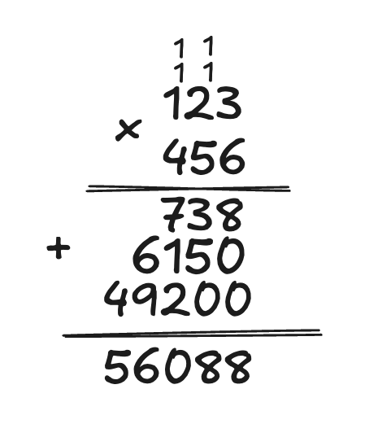
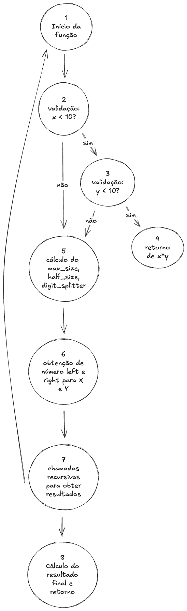

# Algoritmo de Karatsuba

E se fosse possível otimizar computacionalmente multiplicações? Conheça o algoritmo de Karatsuba

## Como executar o código 

Utilizando qualquer versão do python 3 execute o comando abaixo
```bash
python main.py
```

## Funcionamento teorico 

Na escola aprendemos que para para multiplicar dois números podemos fazer o seguinte processo:


Mas e se pudessemos fazer isso de uma maneira diferente e mais rápida para números muito grandes? Foi isso que Anatoli Alexeievitch Karatsuba propôs. De maneira geral o algoritmo funciona da seguinte forma.

### Parte 01 - Uma maneira diferente de escrever um número

Imagine um número com N casas de ordem inteira (ex, 1234), agora como podemos escrever esse mesmo número de uma maneira diferente? Karatsuba prevê a seguinte notação:

$1234 = 12 \times 100 + 34 = 1200 + 34 = 1234$

Se simplificarmos mais um pouco temos

$1234 = 12 \times 10^{N/2} + 34 = 1200 + 34 = 1234$ -- Onde N é a ordem de grande inteira

De maneira geral a ideia é dividir o número pela metade, onde a parte mais a esquerda é multiplicada pela ordem de grandeza inteira e a parte mais a direita é apenas somada a esse novo número.

Para prosseguirmos vamos assumir agora a seguinte notação:
$$
1234 \\
\downarrow \\
A = 12 \\
B = 34 \\
\downarrow \\
10^{N/2}A + B \\
\downarrow \\
1234
$$

### Parte 02 - A sacada de Karatsuba

Seguindo a notação anterior como poderíamos multiplicar os números 1234 e 4567? 

PS: Para simplificar a visualização o lado mais a direita será acompanhado do sufixo `R` e o lado mais a esquerda com o sufixo `L`

$$
 1234 \times 4567 \\ 
 \downarrow  \\

(10^{n/2}A_L + B_R) \times (10^{n/2}C_L + D_R) \\
\downarrow \\
10^{n} (A_L \times C_L) + 10^{n/2} (A_L \times D_R) + 10^{n/2} (B_R \times C_L) + (B_R \times D_R)
\downarrow \\
\text{para simplificar} \\
\downarrow \\
10^{n}X + 10^{n/2}[(A_L \times D_R) + (B_R \times C_L)] + Y \\
\downarrow \\
10^{n}X + 10^{n/2}Z + Y
$$

Tá mas onde entra a sacada que Karatsuba teve para resolver essa expressão? Bom, vamos pensar na seguinte manipulação matemática

$$
 (A_L + B_R) \times (C_L + D_R) \\
 \downarrow \\
  A_L \times C_L + A_L \times D_R + B_R \times C_L + B_R \times D_R \\
$$

Se observarmos melhor perceba que temos expressões já conhecidas

$$
 (A_L + B_R) \times (C_L + D_R) \\
 \downarrow \\
 (A_L \times C_L) + (A_L \times D_R + B_R \times C_L) + (B_R \times D_R) \\
 \downarrow \\
 (X) + (Z) + (Y) \\
$$

Removendo as constantes da expressão origial, podemos chegar a exatamente o mesmo resultado (X+Z+Y) usando a expressão de cima da seguinte maneira

$$
X = A_L \times C_L \\
Y = B_R \times D_R \\
Z = (A_L + B_R) \times (C_L + D_R) \\
\downarrow \\
10^{N}X + (Z-X-Y) + Y \\
\text{Mas por que Z-X-Y?} \\
\text{Bom se olharmos para expressão original} \\
\downarrow \\ 
10^{n}X + 10^{n/2}[(A_L \times D_R) + (B_R \times C_L)] + Y \\
\text{Podemos observar que a parte do meio é exatamente igual a parte do meio de Z também, ou seja,} \\
\text{se calcularmos Z menos X e menos Y estamos obtendo exatamente esse pedaço.}
$$

Com essa nova expressão, descartando as constantes podemos observar que saimos de 4 operações de multiplicação para apenas 3 operações de multiplicação.

## Funcionamento a nível de código

Pensando a nível de código, no arquivo `main.py` foi implementado o algoritmo de Karatsuba em Python, abaixo uma descrição passo a passo de cada passo

### Função auxiliar - get_max_len_from_numbers

```python
def get_max_len_from_numbers(x, y):
    return max(len(str(x)), len(str(y)))
```

Esta função determina o tamanho máximo entre os dois números convertendo-os para string e retornando o maior comprimento. Isso é essencial para determinar o valor de N (número de dígitos) que usamos nas fórmulas matemáticas.

### Função principal - karatsuba_it

```python
def karatsuba_it(x, y):
    if x < 10 and y < 10:
        return x * y
```

**Caso base da recursão**: Se ambos os números são menores que 10 (ou seja, possuem apenas 1 dígito), realizamos a multiplicação direta. Isso corresponde ao momento em que paramos de dividir os números e executamos a operação básica.

```python
    max_size = get_max_len_from_numbers(x, y)
    half_size = max_size // 2
    digit_splitter = 10**half_size
```

Aqui determinamos:
- `max_size`: O valor N da nossa notação matemática (número máximo de dígitos)
- `half_size`: O valor N/2, usado para dividir os números pela metade
- `digit_splitter`: O valor $10^{N/2}$, que usamos para separar a parte $A_L$ da parte $B_R$

```python
    a_left, b_right = divmod(x, digit_splitter)
    c_left, d_right = divmod(y, digit_splitter)
```

Esta é a implementação da divisão dos números conforme nossa notação:
- `a_left` = $A_L$ (parte a esquerda do primeiro número)
- `b_right` = $B_R$ (parte a direita do primeiro número)  
- `c_left` = $C_L$ (parte a esquerda do segundo número)
- `d_right` = $D_R$ (parte a direita do segundo número)

A função `divmod(x, digit_splitter)` retorna `(x // digit_splitter, x % digit_splitter)`, que é exatamente a divisão que fazemos matematicamente para obter 1200 e 34 assim fazendo 1234.

```python
    left_result = karatsuba_it(a_left, c_left)
    right_result = karatsuba_it(b_right, d_right)
    middle_result = karatsuba_it((b_right + a_left), (d_right + c_left))
```

Aqui calculamos as três multiplicações recursivas que correspondem aos valores:
- `right_result` = Y = $B_R \times D_R$
- `left_result` = X = $A_L \times C_L$
- `middle_result` = Z = $(A_L + B_R) \times (C_L + D_R)$

```python
    full_left_result = left_result * 10**(2*half_size)
    adjusted_middle_result = (middle_result - left_result - right_result) * 10**half_size
```

Aqui aplicamos as potências de 10 e fazemos o ajuste do termo do meio:
- `full_left_result` = $10^N \times X$
- `adjusted_middle_result` = $10^{N/2} \times (Z - X - Y)$

Note que $(Z - X - Y)$ é exatamente a expressão $(A_L \times D_R + B_R \times C_L)$

```python
    return full_left_result + adjusted_middle_result + right_result
```

Finalmente, retornamos a soma final: $10^N \times X + 10^{N/2} \times (Z - X - Y) + Y$

## Relatório técnico

### Análise da complexidade ciclomática

Dado a seguinte representação do grafo de fluxo


Com base no grafo podemos calcular a complexidade ciclomática:

$$
E = 9 \text{(Número de arestas)} \\
N = 8 \text{(Número de nós)} \\
Resultado = 9 - 8 + 2 \\
Resultado = 3
$$

Logo temos 3 caminhos possíveis a serem seguidos pelo algoritmo

---

### Análise da complexidade assintótica

#### Complexidade temporal

Dado dois números de tamanho N nós temos 3 chamadas recursivas que tem como entrada valores que possuem N/2 de tamanho (se pensarmos no middle_result ai poderia ser (N/2)+1, mas para simplfificar estou considerando apenas como N/2) e as demais operações possuem tempo constante de execução, dito isso, se aplicarmos a relação de recorrência teremos a seguinte fórmula

$$
T(N) = 3T(n/2) + O(1)
$$

Podemos descartar a operação constante e aplicar o teorema mestre para obter a complexidade assintótica do algoritmo

$$
\text{Teorema mestre} = aT(N/b) + f(n) \\
\text{Resolvendo complexidade pelo teorema mestre} \\
\text{Resultado} = \log{_b}{a} = \log{_2}{3} \approx 1.5 = O(N^{1.5})
$$

Logo, podemos assumir que o algoritmo possui uma complexidade assintótica igual a $O(N^{1.5})$

---

#### Complexidade Espacial

Bom, para o algoritmo vamos descartar todas as atribuições a variáveis pois todas tem uma complexidade espacial constante, vamos apenas considerar as stacks de recursividade. 

Se pararmos para analisar, o algoritmo sempre divide o número em 2 partes até ele ter apenas 1 único digito, isso seria o mesmo que fazer a seguinte pergunta:

> Dado um número de tamanho N, quantas vezes eu consigo repartir ele em 2?

Se pararmos para analisar de maneira um pouco mais profunda isso é o mesmo que fazer:

$$
N \rightarrow \frac{N}{2} \rightarrow \frac{N}{4} \rightarrow \frac{N}{8} \rightarrow ... \rightarrow 1
$$

A pergunta se torna: **quantas divisões por 2 são necessárias para chegar de N até 1?**

Matematicamente isso é equivalente a:

$$
\frac{N}{2^k} = 1
$$

Aplicando a propriedade de logaritmica temos:

$$
N = 2^k \\
k = \log_2(N)
$$

**Exemplo prático:**
- Para N = 8: 8 → 4 → 2 → 1 (3 divisões = log₂(8) = 3)
- Para N = 16: 16 → 8 → 4 → 2 → 1 (4 divisões = log₂(16) = 4)

Cada divisão corresponde a uma stack da recursão, logo a complexidade espacil seria O(log N)

---

#### Melhor caso, caso médio e pior caso 

O máximo que pode acontecer com o algoritmo é ele ter muitas execuções recursivas dependendo do tamanho do número, mas no final das contas ele sempre executará em $O(N^{1.5})$. Ou seja, como já previsto pela análise assintótica ele não sofre uma degradação em sua complexidade dado alguma condição específica, todos os casos são iguais em termos de complexidade.